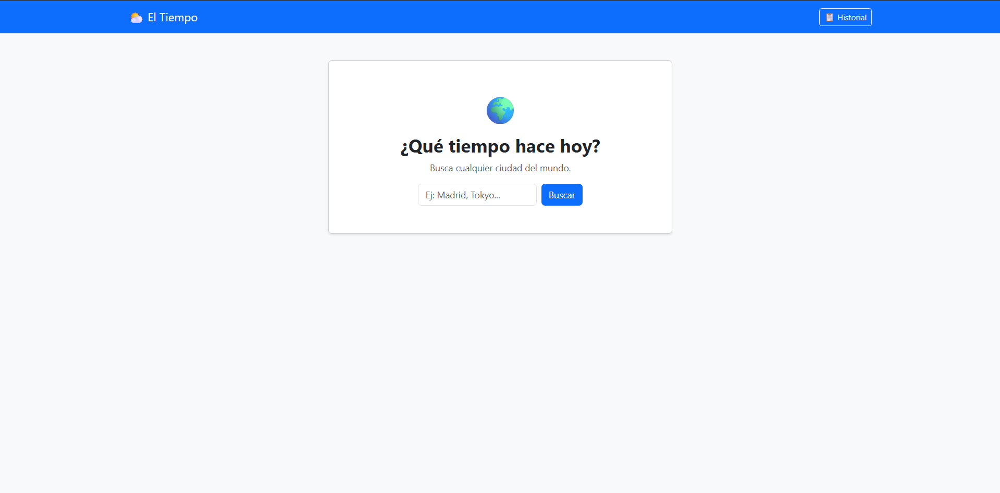
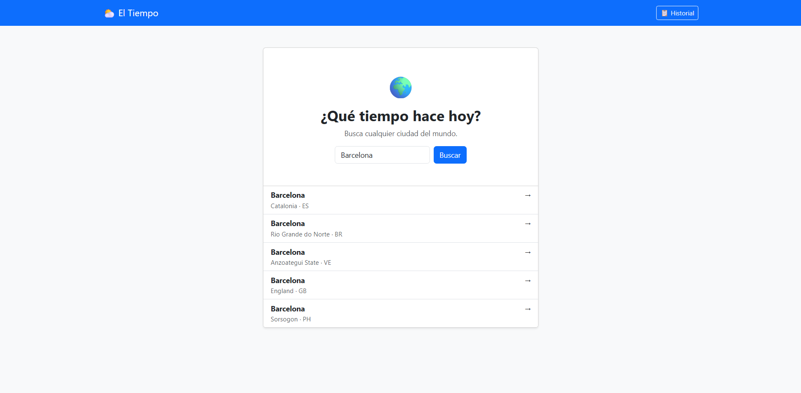
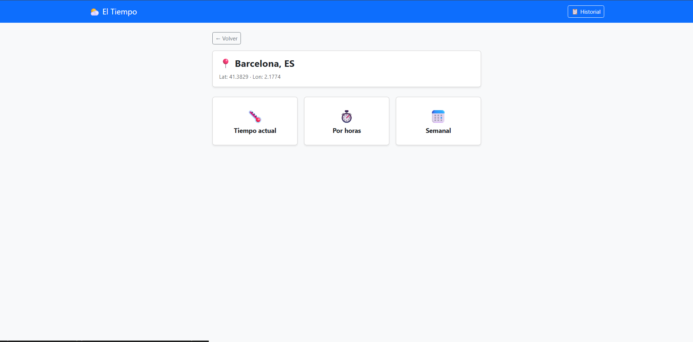
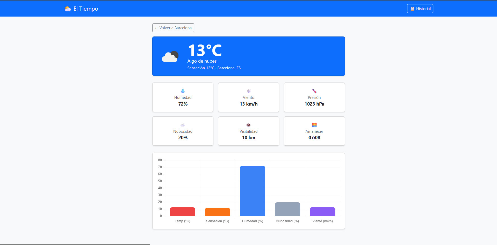
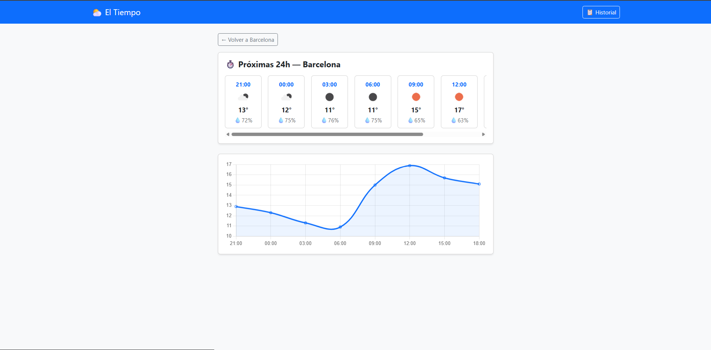
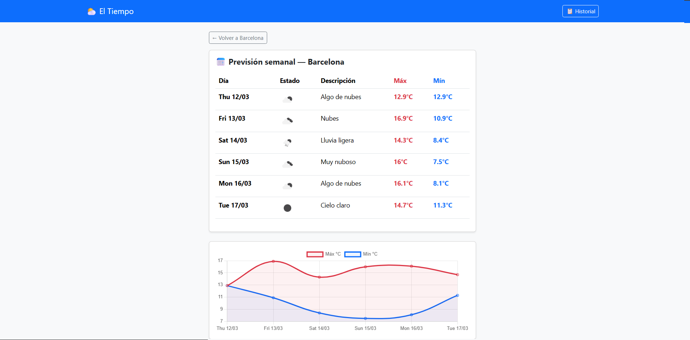
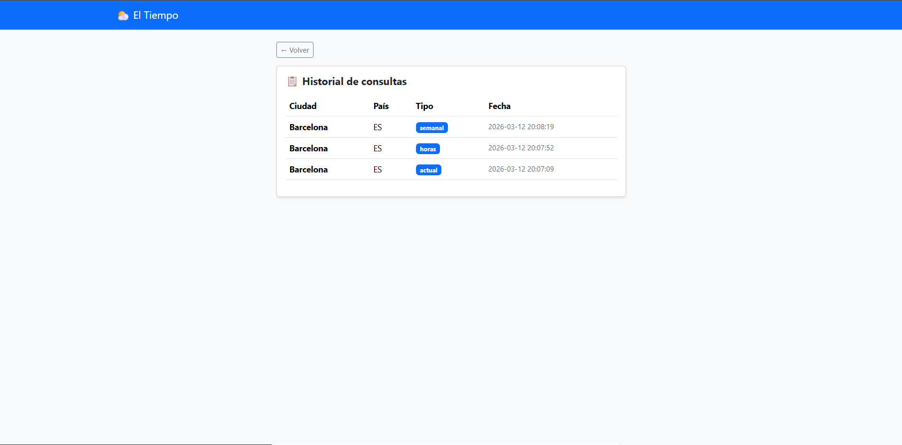
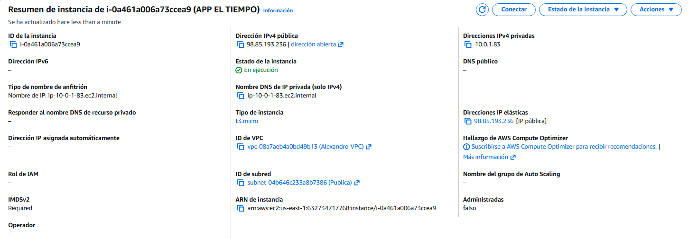

# ⛅ El Tiempo

Aplicación web desarrollada en **PHP** siguiendo el patrón **MVC** que permite consultar el tiempo atmosférico de cualquier ciudad del mundo utilizando la API de **OpenWeatherMap**.

---

## 📑 Índice

1. [Descripción](#-descripción)
2. [Funcionalidades](#-funcionalidades)
3. [Tecnologías](#-tecnologías)
4. [Estructura del proyecto](#-estructura-del-proyecto)
5. [Base de datos](#-base-de-datos)
6. [Instalación con Docker](#-instalación-con-docker)
7. [Despliegue en AWS](#-despliegue-en-aws)
8. [Comprobación](#-comprobación)

---

## 📘 Descripción

El Tiempo es una aplicación PHP estructurada en el patrón **Modelo-Vista-Controlador (MVC)** que permite buscar cualquier ciudad del mundo y consultar su información meteorológica en tiempo real. Utiliza la API de OpenWeatherMap para obtener datos actuales, previsión por horas y previsión semanal. Todas las consultas realizadas se almacenan en una base de datos MySQL.

---

## ✅ Funcionalidades

- 🔍 Búsqueda de ciudades mediante la API de geocoding
- 🌡️ Consulta del tiempo actual (temperatura, humedad, viento, presión...)
- ⏱️ Previsión meteorológica por horas (próximas 24h)
- 📅 Previsión meteorológica semanal (7 días)
- 📊 Gráficas interactivas con Chart.js
- 🗃️ Historial de todas las consultas realizadas
- 🐳 Despliegue con Docker
- ☁️ Desplegada en AWS EC2 con HTTPS mediante Nginx y Certbot

---

## 🛠️ Tecnologías

| Tecnología | Uso |
|---|---|
| PHP  | Backend |
| Apache | Servidor web |
| MySQL  | Base de datos |
| Bootstrap  | Diseño frontend |
| Chart.js | Gráficas |
| Docker y Docker Compose | Contenedores |
| Nginx + Certbot | Proxy y HTTPS |
| OpenWeatherMap API | Datos meteorológicos |
| AWS  | Despliegue en la nube |

---

## 📁 Estructura del proyecto

```
El Tiempo/
├── controladores/
│   ├── ControladorBuscador.php    
│   ├── ControladorCiudad.php       
│   ├── ControladorActual.php     
│   ├── ControladorHoras.php        
│   ├── ControladorSemanal.php    
│   └── ControladorHistorial.php   
├── modelos/
│   ├── Database.php              
│   ├── TiempoAPI.php              
│   └── ConsultaDAO.php             
├── vistas/
│   ├── buscador.php             
│   ├── ciudad.php                 
│   ├── actual.php                
│   ├── horas.php                   
│   ├── semanal.php                 
│   └── historial.php             
├── index.php                     
├── ciudad.php                     
├── actual.php                     
├── horas.php                      
├── semanal.php                    
├── historial.php                   
├── base_de_datos.sql               
├── Dockerfile
└── docker-compose.yml
```

---

## 🗄️ Base de datos

La aplicación utiliza una base de datos MySQL llamada `el_tiempo` con dos tablas:

```sql
CREATE TABLE ciudades (
    id     INT AUTO_INCREMENT PRIMARY KEY,
    nombre VARCHAR(255),
    pais   VARCHAR(10),
    lat    DECIMAL(9,6),
    lon    DECIMAL(9,6)
);

CREATE TABLE consultas (
    id         INT AUTO_INCREMENT PRIMARY KEY,
    ciudad_id  INT,
    tipo       VARCHAR(20),
    fecha      TIMESTAMP DEFAULT CURRENT_TIMESTAMP,
    FOREIGN KEY (ciudad_id) REFERENCES ciudades(id)
);
```

---

## 🐳 Instalación con Docker

### Requisitos
- Docker Desktop instalado y en ejecución

### Pasos

1. Clona el repositorio:
```bash
git clone https://github.com/acastros03/el-tiempo.git
cd el-tiempo
```

2. Añade tu API key de OpenWeatherMap en `modelos/TiempoAPI.php`:
```php
private $key = 'AQUI_TU_API_KEY';
```

3. Levanta los contenedores:
```bash
docker-compose up --build
```

4. Abre el navegador en:
```
http://localhost:8081
```

### Parar la aplicación
```bash
docker-compose down
```

---

## ☁️ Despliegue en AWS

La aplicación está desplegada en una instancia **EC2** de AWS con HTTPS y dominio propio, accesible en:

```
https://labs-iberotech.ddns.net
```

### Pasos para desplegar en EC2

1. Lanza una instancia EC2 (Ubuntu/Debian), abre los puertos **22**, **80** y **443** en el grupo de seguridad.

2. Conéctate por SSH e instala las dependencias:
```bash
sudo apt update
sudo apt install -y git docker.io docker-compose nginx certbot python3-certbot-nginx
sudo usermod -aG docker $USER
newgrp docker
```

3. Clona el repositorio y levanta los contenedores:
```bash
git clone https://github.com/acastros03/el-tiempo.git
cd el-tiempo
docker-compose up -d --build
```

4. Configura Nginx como proxy inverso creando `/etc/nginx/sites-available/el-tiempo`:
```nginx
server {
    listen 80;
    server_name labs-iberotech.ddns.net;

    location / {
        proxy_pass http://localhost:8081;
        proxy_set_header Host $host;
        proxy_set_header X-Real-IP $remote_addr;
    }
}
```

5. Activa la configuración y obtén el certificado SSL:
```bash
sudo ln -s /etc/nginx/sites-available/el-tiempo /etc/nginx/sites-enabled/
sudo nginx -t
sudo systemctl restart nginx
sudo certbot --nginx -d labs-iberotech.ddns.net
```

---

## 🎬 Comprobación

### Buscador de ciudades






### Tiempo actual


### Previsión por horas


### Previsión semanal


### Historial de consultas


### Instancia EC2 en AWS

